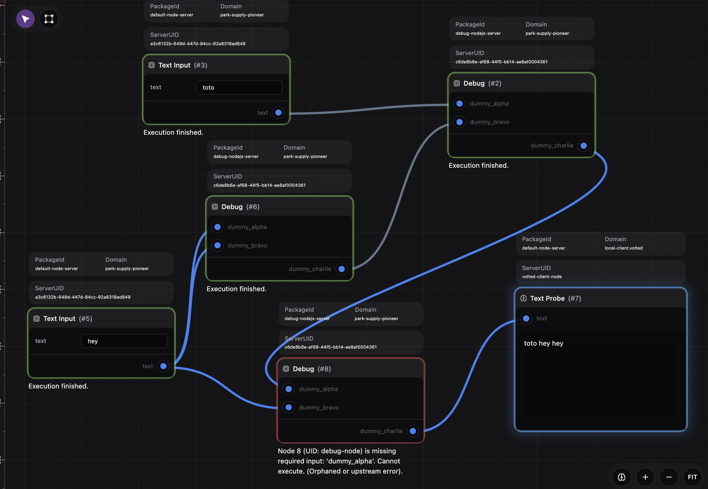

# Debug NodeServer for NanoCore

A debug nodejs server for NanoCore that provides debugging capabilities for your workflows.

## Installation

Install the nodeserver:

```bash
npx nanocore add spartanz51/debug-nodeserver-nodejs
```

## Usage

Import the workflow by downloading the [broken_workflow.json](https://github.com/spartanz51/debug-nodeserver-nodejs/blob/main/broken_workflow.json) file and importing it into your NanoCore instance.


